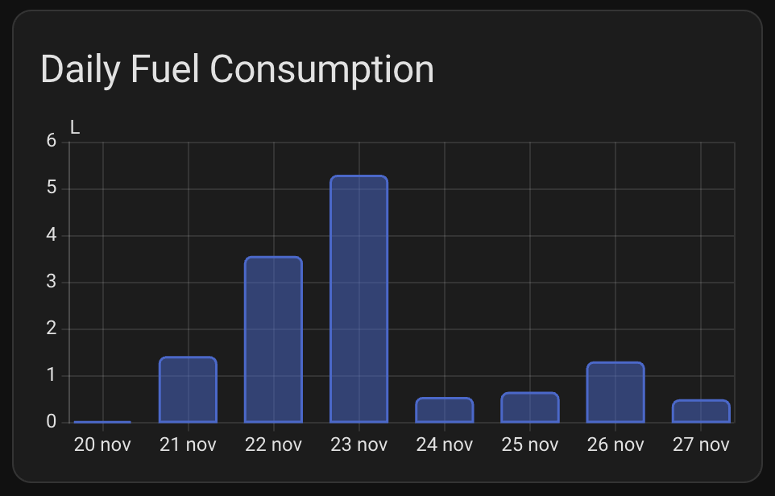

<p align="center">
  
</p>

<h1 align="center">Vevor Diesel Heater - Home Assistant Integration</h1>

<p align="center">
  <a href="https://github.com/hacs/integration"></a>
  <a href="https://github.com/Spettacolo83/homeassistant-vevor-heater/releases"></a>
  <a href="https://github.com/Spettacolo83/homeassistant-vevor-heater/blob/main/LICENSE"></a>
</p>

> This is a maintained fork of the original [homeassistant-vevor-heater](https://github.com/MSDATDE/homeassistant-vevor-heater) by [@MSDATDE](https://github.com/MSDATDE), enhanced with HACS 2.0+ compatibility and additional improvements.

Control your Vevor/BYD Diesel Heater from Home Assistant via Bluetooth.

## Features

- 🌡️ **Climate Entity** - Full thermostat control with target temperature
- 🔥 **Heater Level Control** - Adjust heating power (1-10) via number entity
- ⚙️ **Running Mode Selection** - Switch between Level and Temperature modes
- 📊 **Comprehensive Sensors** - Monitor temperature, voltage, altitude, and heater status
- ⛽ **Fuel Consumption Tracking** - Monitor fuel usage with 3 dedicated sensors
  - Hourly consumption rate (L/h) - real-time instantaneous rate
  - Daily consumption (L) - automatically resets at midnight
  - Total consumption (L) - lifetime tracking
- 🔌 **Bluetooth LE** - Direct local connection, no cloud required
- ⚡ **Real-time Updates** - 30-second polling interval
- 💾 **Data Persistence** - Fuel consumption data saved across restarts

## Supported Devices

This integration has been tested with:
- Vevor Diesel Heater (BYD variant)
- Protocol: AA66 (20-byte unencrypted)
- Bluetooth Service UUID: `0000ffe0-0000-1000-8000-00805f9b34fb`

Other Vevor diesel heaters using similar protocols (AA55 encrypted/unencrypted) may also work.

## Screenshots

### Fuel Consumption Sensors
Monitor your heater's fuel consumption with real-time tracking:


### Heater Controls
Full control over your heater including temperature, level, and mode selection:


## Installation

### HACS (Recommended)

1. Open HACS in Home Assistant
2. Go to "Integrations"
3. Click the three dots menu → "Custom repositories"
4. Add this repository: `https://github.com/Spettacolo83/homeassistant-vevor-heater`
5. Category: "Integration"
6. Click "Add"
7. Search for "Vevor Diesel Heater" and install
8. Restart Home Assistant

### Manual Installation

1. Download the latest release from [GitHub](https://github.com/Spettacolo83/homeassistant-vevor-heater/releases)
2. Copy the `custom_components/vevor_heater` folder to your Home Assistant's `custom_components` directory
3. Restart Home Assistant

## Finding Your Heater's MAC Address

Before adding the integration, you need to find your heater's Bluetooth MAC address:

1. Install Python dependencies:
   ```bash
   pip install bleak
   ```

2. Run the finder script (included in this repo):
   ```bash
   python3 find_heater.py before
   ```

3. **Close the Vevor app** if it's running

4. Open the Vevor app and **connect** to your heater

5. Run the finder script again:
   ```bash
   python3 find_heater.py after
   ```

6. The device that **disappeared** is your heater! Note its MAC address (e.g., `69:96:19:04:59:9B`)

## Configuration

### Add Integration

1. Go to **Settings** → **Devices & Services**
2. Click **"+ Add Integration"**
3. Search for **"Vevor Diesel Heater"**
4. Enter your heater's MAC address (found using the script above)
5. Click **"Submit"**

### Entities Created

After setup, you'll have these entities:

#### Climate
- `climate.vevor_heater` - Main thermostat control
  - Set target temperature (8-36°C)
  - Turn heater ON/OFF
  - Works in Temperature Mode

#### Select
- `select.vevor_heater_running_mode` - Mode selector
  - Level Mode - Set heating level (1-10) for fixed power operation
  - Temperature Mode - Automatic temperature control
  - Note: Manual mode only accessible via physical heater buttons

#### Number
- `number.vevor_heater_level` - Set heater power level (1-10)
- `number.vevor_heater_target_temperature` - Set target temperature (8-36°C)

#### Sensors
- `sensor.vevor_diesel_heater_case_temperature` - Heater case temperature (°C)
- `sensor.vevor_diesel_heater_interior_temperature` - Room/cabin temperature (°C)
- `sensor.vevor_diesel_heater_supply_voltage` - Power supply voltage (V)
- `sensor.vevor_diesel_heater_altitude` - Altitude compensation setting (m)
- `sensor.vevor_diesel_heater_running_step` - Current operation step
- `sensor.vevor_diesel_heater_error` - Error status
- `sensor.vevor_diesel_heater_running_mode` - Current running mode
- `sensor.vevor_diesel_heater_set_level` - Current set level
- `sensor.vevor_diesel_heater_hourly_fuel_consumption` - Instantaneous fuel consumption rate (L/h)
- `sensor.vevor_diesel_heater_daily_fuel_consumed` - Daily fuel consumption (L, resets at midnight)
- `sensor.vevor_diesel_heater_total_fuel_consumed` - Total fuel consumed since installation (L)
- `sensor.vevor_diesel_heater_daily_fuel_history` - Historical daily consumption data (stores last 30 days)

#### Binary Sensors
- `binary_sensor.vevor_diesel_heater_active` - Heater active status

#### Switches
- `switch.vevor_heater_power` - Simple ON/OFF control

## Dashboard Cards

### Recommended Setup

Create a nice dashboard with these cards:

1. **Climate Card** - For temperature control
   ```yaml
   type: thermostat
   entity: climate.vevor_heater
   ```

2. **Mode Selector** - To switch modes
   ```yaml
   type: entities
   entities:
     - entity: select.vevor_heater_running_mode
   ```

3. **Heater Level Control** - For manual power control
   ```yaml
   type: entities
   entities:
     - entity: fan.vevor_heater_heater_level
   ```

4. **Sensor Overview**
   ```yaml
   type: entities
   title: Heater Status
   entities:
     - entity: sensor.vevor_diesel_heater_interior_temperature
     - entity: sensor.vevor_diesel_heater_case_temperature
     - entity: sensor.vevor_diesel_heater_supply_voltage
     - entity: binary_sensor.vevor_diesel_heater_active
   ```

### Fuel Consumption History Graph

The integration automatically imports daily fuel consumption data into Home Assistant's **long-term statistics**, enabling native graphing without any additional cards or plugins!

#### Using Built-in Statistics Graph (Recommended)

**No installation required!** The integration automatically makes historical data available to Home Assistant's native `statistics-graph` card.



**Bar Chart - Last 7 Days:**
```yaml
type: statistics-graph
entities:
  - sensor.vevor_diesel_heater_daily_fuel_consumed
stat_types:
  - sum
period: day
days_to_show: 7
chart_type: bar
title: Daily Fuel Consumption (Last 7 Days)
```

**Line Chart - Last 30 Days:**
```yaml
type: statistics-graph
entities:
  - sensor.vevor_diesel_heater_daily_fuel_consumed
stat_types:
  - sum
period: day
days_to_show: 30
chart_type: line
title: Daily Fuel Consumption (Last 30 Days)
```

**Note**: The statistics are automatically populated from your fuel history. If you have existing history data, it will be imported on the next restart!

#### Using ApexCharts Card (Alternative)

Install [ApexCharts Card](https://github.com/RomRider/apexcharts-card) via HACS for beautiful historical graphs:

**Bar Chart - Last 7 Days:**
```yaml
type: custom:apexcharts-card
header:
  title: Daily Fuel Consumption (Last 7 Days)
  show: true
  show_states: true
graph_span: 7d
span:
  start: day
all_series_config:
  type: column
  opacity: 0.8
series:
  - entity: sensor.vevor_diesel_heater_daily_fuel_history
    data_generator: |
      return Object.entries(entity.attributes.history || {})
        .slice(0, 7)
        .reverse()
        .map(([date, liters]) => [new Date(date).getTime(), liters]);
    name: Liters
    color: '#ff6b6b'
yaxis:
  - decimals: 2
    min: 0
    apex_config:
      title:
        text: Liters (L)
```

**Line Chart - Last 30 Days:**
```yaml
type: custom:apexcharts-card
header:
  title: Daily Fuel Consumption (Last 30 Days)
  show: true
graph_span: 30d
span:
  start: day
all_series_config:
  type: line
  stroke_width: 2
  curve: smooth
series:
  - entity: sensor.vevor_diesel_heater_daily_fuel_history
    data_generator: |
      return Object.entries(entity.attributes.history || {})
        .reverse()
        .map(([date, liters]) => [new Date(date).getTime(), liters]);
    name: Daily Consumption
    color: '#4ecdc4'
yaxis:
  - decimals: 2
    min: 0
    apex_config:
      title:
        text: Liters (L)
```

**Multi-Period Comparison:**
```yaml
type: custom:apexcharts-card
header:
  title: Fuel Consumption Trends
  show: true
series:
  - entity: sensor.vevor_diesel_heater_daily_fuel_history
    attribute: last_7_days
    name: Last 7 Days
    type: column
  - entity: sensor.vevor_diesel_heater_daily_fuel_history
    attribute: last_30_days
    name: Last 30 Days
    type: column
yaxis:
  - decimals: 2
    min: 0
    apex_config:
      title:
        text: Total Liters (L)
```

#### Using Built-in Cards

**Attributes Card - View History Data:**
```yaml
type: entities
title: Fuel History
entities:
  - entity: sensor.vevor_diesel_heater_daily_fuel_history
    type: attribute
    attribute: last_7_days
    name: Last 7 Days Total
  - entity: sensor.vevor_diesel_heater_daily_fuel_history
    type: attribute
    attribute: last_30_days
    name: Last 30 Days Total
  - entity: sensor.vevor_diesel_heater_daily_fuel_history
    type: attribute
    attribute: days_tracked
    name: Days Tracked
```

**Markdown Card - Formatted History:**
```yaml
type: markdown
title: Daily Fuel History
content: |
  
  
  | Date | Liters |
  |------|--------|
  
  | {{ date }} | {{ liters }} L |
  
  
  No history data available yet.
  
```

## Troubleshooting

### Heater Not Found

- Make sure Bluetooth is enabled on your Home Assistant host
- Ensure the heater is powered on
- Vevor app must be **disconnected** (only one BLE connection allowed)
- Try running `find_heater.py` again to verify MAC address

### No Data / Connection Issues

- Check Home Assistant logs: **Settings** → **System** → **Logs**
- Look for entries with `vevor_heater`
- The integration uses exponential backoff (5s, 10s, 20s, 40s) for reconnection

### Commands Not Working

- Verify you're using the correct passkey (default: `1234`)
- Some commands only work in specific modes:
  - Temperature setting: Temperature Mode
  - Level setting: Manual or Level Mode

### Debug Logging

Enable debug logging in `configuration.yaml`:

```yaml
logger:
  default: info
  logs:
    custom_components.vevor_heater: debug
```

## Protocol Details

This integration communicates via Bluetooth LE using the Vevor/BYD diesel heater protocol:

- **Service UUID**: `0000ffe0-0000-1000-8000-00805f9b34fb`
- **Characteristic UUID**: `0000ffe1-0000-1000-8000-00805f9b34fb` (read/write/notify)
- **Protocol**: AA66 (20-byte unencrypted) or AA55 (encrypted variants)
- **Default Passkey**: `1234`

### Commands
- Command 1: Status query
- Command 2: Set running mode
- Command 3: Turn ON (arg=1) / OFF (arg=0)
- Command 4: Set level or temperature

## Changelog

### Version 1.0.13 (Latest)
- **BLE Connection Resilience**: Improved stability for intermittent Bluetooth connections
  - Added "stale data tolerance" - keeps last valid sensor values for 3 failed cycles instead of immediately showing unavailable
  - Reduced log spam by using debug level for repeated connection failures
  - Only shows warning after 4+ consecutive failures
  - Better connection failure handling with cached last valid data

### Version 1.0.12
- **Case Temperature Auto-Detection**: Fixed case temperature parsing for heaters that send direct °C values
  - Some heaters (AA66 unencrypted) send case temperature as direct °C, not 0.1°C format
  - Added auto-detection: if raw value > 350, divide by 10 (0.1°C format); otherwise use raw value (direct °C)
  - Thanks to Umberto for reporting and testing

### Version 1.0.11
- **AA66 Encrypted Protocol Support**: Fixed temperature control for heaters using AA66 encrypted protocol (mode 4)
  - Added protocol-aware command building with extensive debug logging
  - Fixed: Always use AA55 commands (heater only accepts AA55, regardless of response protocol)
  - Fixed: Convert temperature to Fahrenheit for mode 4 heaters that use Fahrenheit internally
  - Fixed: Use `round()` instead of `int()` for temperature conversion to avoid off-by-one errors
- Tested and confirmed working with ESPHome BLE proxy setups
- Resolves Issue #1 for users with AA66 encrypted heaters

### Version 1.0.10
- **ESPHome BLE Proxy Fix**: Fixed temperature setting for ESPHome BLE proxy users (Issue #1)
  - Fixed temperature range from 1-36 to correct 8-36°C
  - Changed BLE write to use `response=False` to avoid 'Insufficient authorization' error with ESPHome BLE proxy and other BLE relay setups
  - Added logging for temperature setting commands
- Resolves issue where target temperature would always revert to 36°C

### Version 1.0.9
- **Critical BLE Connection Stability Fixes**: Resolved 7 major connection problems causing heater unavailability
  - Fixed notification UUID mismatch preventing proper disconnect/reconnect
  - Added proper connection cleanup on failures
  - Increased status request timeout from 2s to 5s
  - Added device wake-up mechanism for deep sleep recovery
  - Limited internal retry attempts to reduce log spam
  - Added service discovery validation
  - Improved connection state cleanup
- Eliminates 'No status received' errors, 'Failed to cancel connection' errors, and '[org.bluez.Error.InProgress]' errors

### Version 1.0.8
- **Native Statistics Graphing**: Daily fuel consumption now automatically imports into Home Assistant statistics
  - No ApexCharts or custom cards needed!
  - Use built-in `statistics-graph` card for beautiful bar/line charts
  - Historical data automatically imported at startup
  - Existing fuel history (up to 30 days) is retroactively imported
  - Works natively with Home Assistant's energy dashboard integration
- **Documentation Fix**: Corrected entity names in README
  - Updated all sensor entity IDs from `sensor.vevor_heater_*` to `sensor.vevor_diesel_heater_*`
  - Fixed dashboard card examples with correct entity names
- **Minor Fix**: Improved sensor availability when heater is offline to prevent graph spikes

### Version 1.0.7
- **New Feature**: Historical Daily Fuel Consumption Tracking
  - Added `sensor.vevor_diesel_heater_daily_fuel_history` to track daily fuel consumption over time
  - Stores last 30 days of consumption data with automatic cleanup
  - History persists across Home Assistant restarts
  - Daily values automatically saved to history at midnight before reset
  - New sensor attributes:
    - `history` - Complete daily consumption history (date -> liters)
    - `days_tracked` - Number of days in history
    - `total_in_history` - Total fuel consumed in tracked period
    - `last_7_days` - Total consumption for last 7 days
    - `last_30_days` - Total consumption for last 30 days
- **Dashboard Integration**: Added comprehensive graphing examples
  - ApexCharts configurations for bar and line charts
  - Built-in card examples (markdown, attributes)
  - Support for 7-day, 30-day, and custom time ranges
- **Data Persistence**: History automatically saved with daily resets

### Version 1.0.6
- **Critical Fixes**: Prevent crashes and fix daily fuel reset when heater is offline
  - Fixed commands (turn on/off, set level/temperature) causing HA crashes when heater disconnected
  - Commands now check connection status before requesting refresh
  - Only refresh state if command was successfully sent
  - Fixed daily fuel counter not resetting at midnight when heater offline
  - Daily reset check now runs on every coordinator update regardless of connection
  - Reset happens even if heater is off/unreachable at midnight

### Version 1.0.5
- **Critical Fix**: Prevent Home Assistant crashes during integration startup
  - Added 30-second timeout on initial connection attempt
  - Setup now completes even if heater is offline/unreachable
  - Integration retries connection in background every 30 seconds
  - Entities show as "unavailable" until connection succeeds
  - **Home Assistant now starts normally** even if heater is off/out of range
  - Improved logging with helpful troubleshooting messages

### Version 1.0.4
- **Bug Fix**: Fixed Daily Fuel Consumed sensor not resetting at midnight
  - Added runtime check for date change (previously only checked at startup)
  - Daily counter now properly resets to 0.0L when midnight passes
  - Separate tracking for daily vs total fuel consumption
  - Data automatically saved after midnight reset

### Version 1.0.3
- **Fuel Consumption Tracking** - Monitor fuel usage based on power level estimation
  - Hourly consumption rate sensor (L/h) - instantaneous rate with decimal precision
  - Daily fuel consumed sensor (L) - automatically resets at midnight
  - Total fuel consumed sensor (L) - lifetime consumption tracking
  - Data persisted across Home Assistant restarts
- **Bug Fixes**
  - Fixed climate entity showing as unavailable in newer HA versions
  - Fixed fuel sensors showing "Unknown" values
  - Fixed fuel tracking not updating due to protocol parser bug
  - Fixed hourly fuel consumption displaying integers instead of decimals
- **Improvements**
  - Removed non-functional "Manual" mode from running mode selector
  - Running mode can now be switched between "Level Mode" and "Temperature Mode"
  - Manual mode only accessible via physical heater buttons
- Consumption calculated using VEVOR specifications (0.16-0.52 L/h range)
- Compatible with all protocol variants (AA55/AA66, encrypted/unencrypted)

### Version 1.0.2 (Fork)
- Fixed HACS icon display by adding logo URL to hacs.json

### Version 1.0.1 (Fork)
- Fixed HACS 2.0+ compatibility by restructuring repository
- Moved integration files to `custom_components/vevor_heater/`
- Added `hacs.json` configuration file
- Added VEVOR brand icon for better visual identification
- Updated repository URLs and metadata
- Maintained full compatibility with original integration

### Version 1.0.0 (Original)
- Initial release by [@MSDATDE](https://github.com/MSDATDE)
- Full climate entity support with thermostat control
- Heater level control via fan entity
- Multiple running modes (Manual, Level, Temperature)
- Comprehensive sensor suite
- Bluetooth LE connectivity
- Temperature calibration feature

## Contributing

Contributions are welcome! Please feel free to submit a Pull Request.

## License

This project is licensed under the MIT License - see the [LICENSE](LICENSE) file for details.

## Acknowledgments

- **Original Author**: [@MSDATDE](https://github.com/MSDATDE) - Thank you for creating this excellent integration!
- **Original Repository**: [MSDATDE/homeassistant-vevor-heater](https://github.com/MSDATDE/homeassistant-vevor-heater)
- Based on the [vevor-ble-bridge](https://github.com/andyrak/vevor-ble-bridge) protocol documentation
- Thanks to the Home Assistant community for support

## Support

If you encounter issues, please:
1. Check the [Issues](https://github.com/Spettacolo83/homeassistant-vevor-heater/issues) page
2. Enable debug logging and include logs in your report
3. Provide your heater model and protocol type (AA55/AA66)

---

**Disclaimer**: This is an unofficial integration and is not affiliated with Vevor or BYD.
